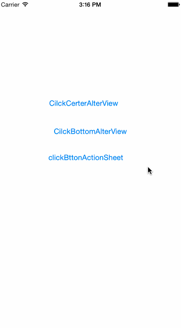

# CustomAlterView
baseDownCustomIOSAltertView
###Example



-----------------------------------
```objc
CustomIOSAlertView *alter  =  [[CustomIOSAlertView alloc]init];
alter.titleColor = [UIColor redColor];
alter.buttonTitles = @[@"取消",@"确定"];
alter.message = @"确定要提交作业吗？";
alter.delegate = self;
[alter show];

```
```objc
#### 2.1.0 - 2015/08/25
titleColor 和buttonColor 可修改;
#### add actionsheet 
``
### 链接
1.[点击这里你可以链接到www.google.com](http://www.google.com)<br />
2.[点击这里我你可以链接到我的博客](http://guoyunsky.iteye.com)<br />