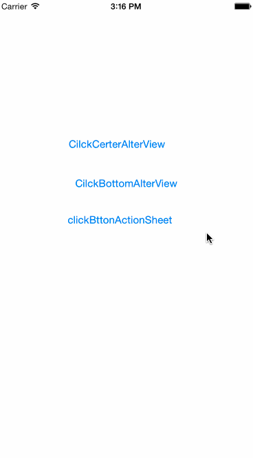

# CustomAlterView
baseDownCustomIOSAltertView
###Example



```objc
CustomIOSAlertView *alter  =  [[CustomIOSAlertView alloc]init];
alter.titleColor = [UIColor redColor];
alter.buttonTitles = @[@"取消",@"确定"];
alter.message = @"确定要提交作业吗？";
alter.delegate = self;
[alter show];

```

